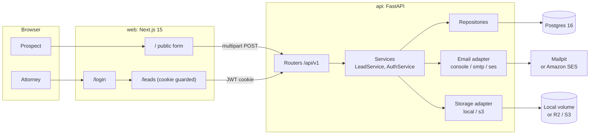
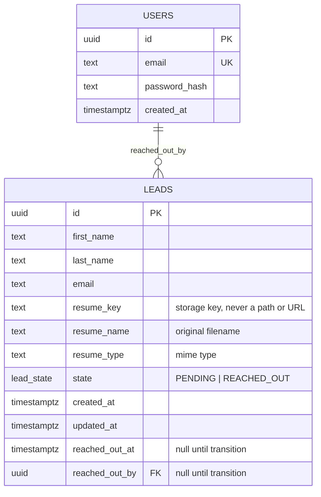
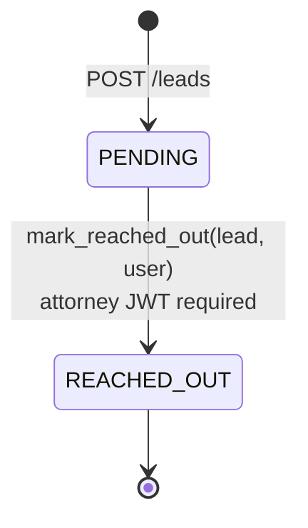

# Design: Alma Lead Intake

This document explains what the system does and why it is built the way it is. The build plan with the final decisions is `docs/PLAN.md`; this is the long form.

## 1. Requirements

From the assignment (`docs/ASSIGNMENT.md`):

| # | Requirement | How it is met |
|---|---|---|
| R1 | Public form: first name, last name, email, resume/CV, all required | `POST /api/v1/leads` (multipart, no auth) behind the Next.js page at `/` |
| R2 | On submission, email the prospect and an attorney | Two emails queued with FastAPI `BackgroundTasks` after the DB commit |
| R3 | Internal UI behind auth listing every submitted field | `/leads` page, guarded by a JWT in an httpOnly cookie |
| R4 | Lead state `PENDING` -> `REACHED_OUT`, set manually by an attorney | `PATCH /api/v1/leads/{id}/state`, service-layer transition, 409 on anything else |
| R5 | FastAPI for the API, Next.js for the web app | As specified |
| R6 | Persistent storage and an email service | Postgres for data; local disk or S3/R2 for resumes; Mailpit, SES or console for email |
| R7 | Production-style structure | Layered backend (routers, services, repositories, adapters), migrations, typed schemas, CI |

Non-functional goals we set for ourselves:

- A reviewer runs the whole flow with one command and zero credentials, and can see both emails.
- Every external dependency sits behind an adapter with a local implementation and a production implementation.
- The state machine is enforced in one place in the service layer, not in the router or the UI.

## 2. Architecture



Request path for a submission:

1. Browser posts multipart form data to the API.
2. Router validates the fields with Pydantic and the file by size and magic bytes.
3. Service uploads the resume through the storage adapter, receiving an opaque key.
4. Repository inserts the lead in `PENDING`; the transaction commits.
5. Two `BackgroundTasks` send the confirmation and notification through the email adapter. Failures are logged and never surface to the prospect. The lead is already saved.
6. Router returns 201 with the lead.

Layering rules, enforced by convention and review:

- Routers know HTTP. They do not touch the ORM.
- Services own business rules and transactions. They depend on repository and adapter interfaces.
- Repositories are the only code that issues SQL.
- Adapters wrap external systems and expose a minimal interface; test doubles implement the same interface.

## 3. Data model



Notes:

- `resume_key` is an opaque key resolved by the storage adapter. The database never contains a filesystem path or URL, so switching storage backends does not touch the data.
- `reached_out_at` and `reached_out_by` give an audit trail for the one transition the system has. Adding more states later would push this into a separate `lead_events` table; with one transition, two columns are enough.
- Alembic owns the schema. The enum is a Postgres enum type created in the first migration.

## 4. Lead state machine



There is exactly one transition. `LeadService.mark_reached_out` checks the current state, sets `state`, `reached_out_at` and `reached_out_by`, and commits. Any other request, including `REACHED_OUT -> REACHED_OUT` and `REACHED_OUT -> PENDING`, raises `InvalidTransition`, which the API maps to 409 Conflict. Putting this in one method means the rule is tested once and cannot drift between the API and the UI.

## 5. Adapters and local-first defaults

Both integrations are behind small Protocols (`backend/app/adapters/*/base.py`):

```
EmailAdapter.send(message: EmailMessage) -> None          # EmailMessage(to, subject, text, html)
StorageAdapter.put(key, data, content_type) -> None
StorageAdapter.delete(key) -> None                        # cleanup if the DB insert fails
StorageAdapter.stream(key) -> AsyncIterator[bytes]        # KeyError if missing; local download path
StorageAdapter.presigned_url(key, expires_in) -> str | None   # signed URL for s3, None for local
```

Each provider module exposes `create_adapter(settings)`, and the API loads
`app.adapters.<kind>.<provider>` by the `EMAIL_PROVIDER` / `STORAGE_PROVIDER`
environment variables at first use. Adding a provider is one new module.

| Adapter | Local default | Production | Tests |
|---|---|---|---|
| Email | `smtp` to Mailpit (inbox at :8025) | `ses` via boto3 | `FakeEmailAdapter` records sent messages |
| Storage | `local` to a Docker volume | `s3` via boto3, endpoint override for R2 | `FakeStorageAdapter` in memory |

Why local-first: the assignment is reviewed by people who should not have to create AWS or Cloudflare accounts to see it work. With the defaults, `docker compose up` gives a working form, a real Postgres, a real SMTP server with a web inbox, and resumes on disk. The production path is a change of environment variables, not code, and the same tests cover both because they run against the interface.

Why adapters rather than a library abstraction: the surface area is tiny (send an email, store and fetch a blob). A hand-written interface is a few lines, needs no extra dependency, and keeps the fake implementations honest.

## 6. Email provider decision

Three providers were compared on price, maturity and integration effort. Prices are as of September 2026.

| Provider | Price per 1,000 emails | Free tier | Status | Notes |
|---|---|---|---|---|
| Amazon SES | $0.10 (à la carte) | New accounts get AWS Free Tier credits usable on SES | GA since 2011 | boto3 already a dependency for S3/R2 |
| Cloudflare Email Sending | $0.35 after 3,000 included on the $5/month Workers Paid plan | none without the paid plan | Public beta since April 2026, no GA, no SLA | REST, SMTP and Workers binding |
| Resend | $0.90 | 100 per day | GA | Nicest developer experience |

Decision: Amazon SES.

- Cost: 3.5x cheaper than Cloudflare and 9x cheaper than Resend per thousand at volume. Lead intake volume is low, so this is not decisive alone.
- Maturity: SES has fifteen years in production with published SLAs. Cloudflare Email Sending is still in public beta; a law firm's confirmation emails should not depend on a beta.
- Integration: the storage adapter already uses boto3, so SES adds no new SDK.
- Resend was the runner-up for its API and templates, and would be the choice if developer experience mattered more than price. Its free tier cap of 100 per day is also fine for this scale, but the à la carte price is the highest of the three.

The `smtp` adapter is not only for Mailpit: SES also exposes an SMTP interface, so an operator who prefers SMTP credentials over IAM keys can point `SMTP_HOST` at SES without code changes.

## 7. Storage decision

Resumes are binary blobs of up to 5 MB that are written once and read rarely. Object storage is the natural fit.

| Option | Free tier | Egress | Code path |
|---|---|---|---|
| Cloudflare R2 | 10 GB stored, permanent | $0 | boto3 with `endpoint_url` |
| AWS S3 | 5 GB for 12 months | Charged per GB | boto3 |
| Postgres `bytea` | n/a | n/a | Bloats the DB, complicates backups |
| Local disk | n/a | n/a | Not durable across hosts |

Decision: the `s3` adapter, pointed at R2 by default in production. R2 is S3-API compatible, so the only difference from AWS is `S3_ENDPOINT_URL`. R2's permanent free tier and zero egress make it cheaper for this workload, and the identical code path means there is no lock-in: clear the endpoint variable and the same container writes to S3.

Access is via short-lived signed URLs generated by the API after the attorney's JWT is verified. The bucket stays private and the browser never talks to storage with credentials. Locally, the same endpoint streams the file from disk.

## 8. Database: Postgres over DynamoDB or D1

- The data is relational: leads reference the user who reached out, and the list view sorts and filters by state and date. Postgres does this with an index; DynamoDB needs access patterns designed up front and secondary indexes for each new filter.
- Tooling: SQLAlchemy 2.0 async plus Alembic gives typed models and versioned migrations. Reviewers know how to inspect a Postgres database.
- D1 is SQLite at the edge and only reachable from Workers, which we are not using (see below). It also lacks the Postgres enum and timestamptz semantics used here.
- Operationally, managed Postgres (RDS, Neon, Supabase, Cloud SQL) is available everywhere the container could run.

## 9. Runtime: container over Cloudflare Python Workers

Cloudflare Python Workers do run FastAPI (via Pyodide with a built-in ASGI bridge), so the assignment's FastAPI requirement does not rule them out. What does rule them out is the database layer: Pyodide cannot load native extensions, so `asyncpg` and `psycopg` are unavailable, and with them SQLAlchemy's Postgres dialects and Alembic. Running on Workers would mean D1 over HTTP bindings with hand-written SQL and no migration tool. That trades away the production structure the assignment asks for.

The application is a standard ASGI app in a standard container, so it runs on any container platform (ECS, Cloud Run, Fly.io, a VM). If Workers gains native Postgres support later, the adapter boundaries make the port a matter of wiring.

## 10. Authentication

- A single attorney user is seeded from `SEED_USER_EMAIL` and `SEED_USER_PASSWORD` at startup (idempotent).
- Passwords are hashed with bcrypt. Login issues an HS256 JWT set as an httpOnly, SameSite=Lax cookie. The browser cannot read the token, which removes the most common XSS token-theft path.
- Next.js `middleware.ts` checks for the cookie on `/leads` and redirects to `/login`. The API independently verifies the JWT on every protected route; the middleware is a UX convenience, not the security boundary.
- Logout clears the cookie server-side.

## 11. Security notes

- **Resume validation by magic bytes.** The upload is checked for size (5 MB, enforced by reading at most one byte past the limit) and file signature: `%PDF` for PDF, the OLE2 header for `.doc`, and the ZIP header plus a `word/document.xml` entry for `.docx`. The client's extension and `Content-Type` header are ignored; the detected type is what gets stored. A renamed executable, or a plain zip renamed to `.docx`, is rejected.
- **Signed URLs.** With the `s3` adapter the resume endpoint returns a 302 to a URL that expires within minutes. The bucket is never public and the key is never exposed except through an authenticated request.
- **No resume attachments in email.** The attorney notification links to the internal lead page rather than attaching the file. Email is not a safe transport for documents that may contain personal data, and attachments would bypass the auth on the resume endpoint.
- **httpOnly session cookie.** Covered above. `Secure` is set when `PUBLIC_WEB_URL` is https.
- **Stored keys, not paths.** `resume_key` is generated server-side (UUID-based), so user-supplied filenames never touch the filesystem or bucket path. The original filename is stored separately for display only.
- **Secrets only via environment.** `.env` is gitignored; `.env.example` contains only local defaults. Compose falls back to the same defaults so no secret is ever required to run.
- **Non-root container.** The API image runs as an unprivileged user.
- **Email failure isolation.** Emails are sent after commit in background tasks; a provider outage cannot lose a lead or leak an internal error to the prospect.

## 12. Testing strategy

- `pytest` with `httpx.AsyncClient` against the ASGI app, using an isolated Postgres test database that the suite creates and migrates per session and truncates per test.
- Email and storage are swapped for fakes through dependency overrides, so tests assert on "two emails were sent, one to the prospect and one to the attorney" and "the resume was stored under the returned key" without network or disk.
- The state machine has explicit tests for the valid transition, the repeated transition (409), the reverse transition (409) and the unauthenticated attempt (401).
- Adapters have their own unit tests: SMTP against an in-process `aiosmtpd` server, SES and S3 against `moto`, local disk against a temp directory, plus a wiring test that loads every provider through the real `create_adapter` path.
- CI runs ruff, mypy and pytest for the backend with a Postgres service container, and eslint plus tsc for the frontend, on every push.

## 13. Next steps

Deliberately out of scope for the six-hour build, in rough priority order:

1. **Rate limiting and abuse controls** on the public endpoint (per-IP limits, a CAPTCHA or Turnstile challenge, virus scanning of uploads).
2. **Pagination and search** beyond `limit`/`offset`: cursor pagination, full-text search on name and email, sorting options in the UI.
3. **Multi-user auth and admin management**: attorney invitations, password reset, roles, audit log of who viewed which resume. Today there is one seeded user.
4. **Message queue for email**: replace `BackgroundTasks` with a durable queue (SQS, or Postgres-backed with retries) so delivery survives an API restart and failures are retried.
5. **Infrastructure as code**: Terraform for the database, bucket, SES identity and the container service; today deployment is manual.
6. **Kubernetes or a managed container platform** with health-based rollouts. The image and health endpoint are ready for it.
7. **Multi-tenancy** if more than one firm is onboarded: tenant column on leads and users, per-tenant email identities.
8. **Separate credentials per adapter**: the `AWS_*` variables are shared by SES and S3. Running SES on AWS with storage on R2 needs distinct key pairs.
9. **Observability**: structured logs already exist; add tracing and metrics (OpenTelemetry) and alerting on email failures.
